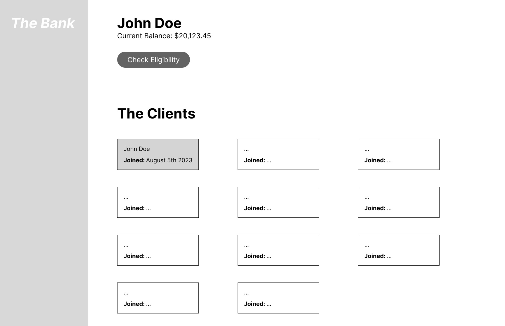

# Overview

In this assignment you will build an interactive bank administrator interface, where a clerk can find information about the bank's clients and their accounts. The clerk can also inquire on eligibility for new loans on behalf of a client by hitting an underwriting service with the required information.


# Instructions
1. Fork this repository and create a new branch for your development work
1. Create your implementation following the [Specification](#specification) below
1. Add instructions on how to run your implementation to the [Getting Started](#getting-started) section.
1. In the [follow-up questions](#follow-up-questions) section below, respond inline to each of the questions.
1. Commit your implementation and answers to your fork and give us access to the repo.

**Guidelines:**
- Do not spend longer than two hours on your implementation, a perfect implementation is not required or expected. Please move on to the [follow-up questions](#follow-up-questions) after that.
- You may use any libraries or frameworks of your choosing (e.g. React, Svelte, etc.)
- The visual design of the components is not super important. Feel free to use an existing component framework (e.g. Material Design, Bootstrap, etc.) or design your own.


# Specification

You will build the following functionality:
  - [ ] Load clients from the provided endpoint (See [Exercise Data](#exercise-data))
  - [ ] Display the clients in a 3 column grid, showing their name and the date they opened their account.
  - [ ] A client's balance is calculated as the sum of all transactions since their last statement, plus their starting balance.
  - [ ] When a user clicks on a client, toggle a visual "selected" state to indicate it has been selected, and show their current balance.
  - [ ] When the "Check loan eligibility" button is pressed, send a POST request with the selected client's information to the underwriting service (See [Underwriting Service](#underwriting))
  - [ ] If the client is eligible for a loan, display a message indicating the loan amounts and rates available.
  - [ ] If the client is not eligible, display a message indicating they were declined.



## Exercise Data

The client list can be loaded by making an HTTP request to the following URL:
- `https://inscope-takehome-service.onrender.com/clients`

Notice that this server runs on a free-tier Render account, so it might be slow to wake up on your first request.


The JSON response is structured as follows:
```js
{
  "count": 1,                     // the number of items in the collection
  "next": "",                     // the url to follow for the next page
  "previous": "",                 // the url to follow for the previous page
  "results": [                    // a list of Client objects
    {"id": "",                    // the unique identifier for this client
     "first_name": "",            // the client's first name
     "last_name": "",             // the client's last name
     "client_since": "",          // timestamp the client joined the bank
     "previous_period_balance": 1 // the client's last balance, in cents
     },
     ...
    ]
}

````


The client transactions since the last statement can be loaded by making an HTTP request to the following URL:

- `https://inscope-takehome-service.onrender.com/clients/<client_id>/transactions`

The JSON response is structured as follows:

```js
{
  "count": 1,         // the number of items in the collection
  "next": "",         // the url to follow for the next page
  "previous": "",     // the url to follow for the previous page
  "results": [        // a list of Client objects
    {"id": "",        // the unique identifier for this transaction
     "detail": "",    // a note about the transaction's origin
     "amount": "",    // the transaction amount, in cents
     "timestamp": "", // timestamp when the transaction occurred
     },
     ...
    ]
}
```

## Underwriting

A server-side underwriting service is available at the following url:
`https://inscope-takehome-service.onrender.com/underwrite`


To check a client's eligibility, create a POST request where the body contains a JSON object with the keys:

- `current_balance` with the balance in cents calculated above
- `num_transactions` with the number of transactions in the current period
- `client_since`, with a date formatted `YYYY/MM/DD`

For example, a client with a balance of $123.45, with 3 in-period transactions who joined the bank on December 1st 2021 we'd send a request as defined in the JSON object below:

**Request Body**
```js
{
  "current_balance": 12345,
  "previous_period_balance": 6789,
  "num_transactions": 3,
  "client_since": "2021/12/01"
}
```

**Response**
```js
{
  "eligible": true,  // boolean indicating eligibility for this client
  "amount": 50000,   // loan amount, in cents, in this case quivalent to $500.00
  "bp_rate": 325     // annual rate percentage in basis points, in this case equivalent to 3.25%
  "reason": null
}
```

# Getting Started

1. This project depends on npm version 8.19.4 (likely any later npm version will do)
2. Navigate to the `bank-app` directory: `cd bank-app`
3. Run `npm install`
4. Run `npm run start`
5. This should open your browser to the app on localhost:3000

# Follow-Up Questions

  1. Describe which task you found most difficult in the implementation, and why.

  The most difficult task was an attempt to complete this quickly. I haven't worked on much frontend in a year or two so was rusty.
  2. What lead you to choose these libraries or frameworks you used in your implementation?

  React is industry standard and a framework I'm familiar with. Components make state management easier.

  Typescript is also becoming an industry standard and allows for better type checking to catch bugs before runtime. 

  3. If there were no time restrictions for this exercise, what improvements would you make in the following areas:

      - Implementation 
        * finish implementation, primarily the underwritting service
        * format the balance to currency
        * clean up the file structure (create compenents and interfaces directories)
      - User Experience
        * Indicate to the user when data is loading to account for the slow Render backend warmup
        * I'm unsure if the page needs to be refreshed to load data after making the first request to the Render service. If so, I'd make modifications so that the user doesn't have to refresh the page
      - Accessibility
        * make the app screen-reader friendly with ARIA

  4. If you were asked to refactor this exercise so it could be display historical data, what changes would you make?

      - We could display a transactions list when selecting a user. To make it more readable, we could route to a seperate 'user detail' page that's not cluttered by other users
      - We could display previous eligibility results (this might require a backend change)
  5. Assume you are provided with a unique identifier for loan application submitted by the clerks. You are tasked with storing requests in persistent storage so bank managers can track patterns in loan applications. Give a high level overview of how you would implement this feature.

  To track loan applications, I would create a service that takes in the unique identifier and other application information (current_balance, num_transactions, etc), and stores it in some database. How to create the service and which database to use will depend on the current infrastructure of the other parts of the business, because it's generally wise to minimize dependencies on technologies if it can be avoided. One approach would be to use an AWS Lambda function that's connected to DynamoDB. The DynamoDB database would store loan application request data for each user. Ideally, we have access to the underwriting service backend, and we can modify that backend to make a request to the Lambda / DynamoDB application tracking service. If we don't have access to the underwriting service, the frontend of our application can wait for the underwriting response data, then send underwriting request, response, and unique identifier data to the Lambda / DynamoDB service.

# Evaluation Criteria

You will be evaluated out of a total of 50 points based on the following criteria.

  - Learning Exercise (30 points total)
    - **Functionality (20 points)**: is the requested functionality implemented as described without bugs?
    - **Code Quality (10 points)**: is the code well structured and easily read? is the code optimized for performance?
    - **Bonus (3 maximum)**: bonus points are awarded for anything that goes above and beyond the items in the specification.  For example, a responsive implementation, or improvements for accessibility.
  - Follow Up Questions (20 points total)
    - Question 1 (2 points)
    - Question 2 (3 points)
    - Question 3 (5 points)
    - Question 4 (5 points)
    - Question 5 (5 points)
